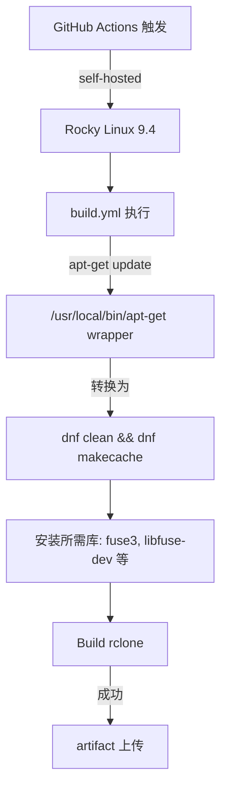

# GitHub Actions 在 Rocky Linux 9.4 上的兼容性问题与解决方案

## 📋 问题总结

当在 Rocky Linux 9.4 上运行 GitHub Actions 自托管 Runner 时，rclone 构建流程中的某些步骤会失败，**即使不修改 `.github/workflows/build.yml` 文件**。

### 🔴 核心问题

在 `build.yml` 的 "Install Libraries on Linux" 步骤（第 127-134 行）：

```yaml
- name: Install Libraries on Linux
  run: |
    sudo modprobe fuse
    sudo chmod 666 /dev/fuse
    sudo chown root:$USER /etc/fuse.conf
    sudo apt-get update                              # ❌ Rocky 上无法执行
    sudo apt-get install -y fuse3 libfuse-dev ...     # ❌ apt-get 不存在
  if: matrix.os == 'ubuntu-latest'
```

**为什么会执行？**

虽然条件是 `if: matrix.os == 'ubuntu-latest'`，但这个值来自 workflow matrix 定义，**与实际运行的操作系统无关**。当在 self-hosted runner 上运行时：
- `matrix.os` 仍然被设为 'ubuntu-latest'（来自 matrix 配置）
- 实际系统是 Rocky Linux 9.4
- 结果：条件评估为 true，但 `apt-get` 不存在

---

## ✅ 解决方案：apt-get Wrapper

### 原理

创建一个位于 `/usr/local/bin/apt-get` 的 shell 脚本，将所有 `apt-get` 命令**自动转换**为 `dnf` 等价命令。

### 转换规则

| apt-get 命令 | dnf 等价命令 |
|------------|-----------|
| `apt-get update` | `dnf clean all && dnf makecache` |
| `apt-get install -y pkg` | `dnf install -y pkg` |
| `apt-get remove pkg` | `dnf remove -y pkg` |
| `apt-get autoremove` | `dnf autoremove -y` |
| `apt-get clean` | `dnf clean all` |

### 优势

✅ **不修改任何 YAML 文件**
✅ **完全透明**：构建脚本无须修改
✅ **易于部署**：一次性配置，自动对所有 GitHub Actions 任务生效
✅ **向后兼容**：真实 Ubuntu 环境仍正常工作

---

## 🛠️ 实施步骤

### 步骤 1: 运行环境初始化脚本

```bash
# 该脚本会自动创建 apt-get wrapper
sudo bash setup-rocky-9.4-ci-env.sh
```

**脚本中新增的功能：**

```bash
# 创建 wrapper 脚本
cat > /usr/local/bin/apt-get << 'EOF'
#!/bin/bash
COMMAND="$1"
shift

case "$COMMAND" in
    update)
        dnf clean all -y && dnf makecache -y
        ;;
    install)
        dnf install -y "$@"
        ;;
    remove|purge)
        dnf remove -y "$@"
        ;;
    clean)
        dnf clean all -y
        ;;
    *)
        dnf "$COMMAND" "$@"
        ;;
esac
EOF

chmod +x /usr/local/bin/apt-get
```

### 步骤 2: 验证 (可选)

```bash
# 测试 wrapper 是否正常工作
apt-get update          # 应该执行 dnf clean all && dnf makecache
apt-get install curl   # 应该执行 dnf install -y curl
apt-get --version      # 应该显示 dnf 的版本信息
```

### 步骤 3: 部署 GitHub Actions Runner

部署过程无须修改，按原有 HTML 文档的步骤进行。wrapper 会自动处理所有 `apt-get` 调用。

---

## 📦 额外依赖

脚本还会自动安装以下库，这些库在 build.yml 中被引用：

### 已自动安装

- **fuse3** / **fuse-devel**: FUSE 文件系统库（支持 cmount）
- **nfs-utils**: NFS 支持
- **git-annex**: Git 扩展（可选但推荐）
- **pkg-config**: 编译配置工具
- **pigz**: 并行压缩工具

### 验证安装

```bash
# 验证关键工具
ls -la /usr/local/bin/apt-get    # 确保 wrapper 存在
fuse3ctl --version               # 验证 FUSE3
mount -V                         # 验证 mount 工具
git annex version 2>/dev/null    # 验证 git-annex（如已安装）
```

---

## 🔍 工作流验证

构建运行时的步骤执行顺序：

```
1. Set up job (5s)
2. Checkout (4s)  
3. Install Go (18s)
4. Set environment variables (0s)
5. Install Libraries on Linux (0s-5s)  ← wrapper 在此处接管
   └─ sudo modprobe fuse           ✅
   └─ sudo chmod 666 /dev/fuse     ✅  
   └─ sudo chown root:$USER /etc/fuse.conf  ✅
   └─ sudo apt-get update          ✅ (通过 wrapper 转换)
   └─ sudo apt-get install -y ...  ✅ (通过 wrapper 转换)
6. Print Go version and environment (0s)
7. Build rclone (X秒)             ✅
8. Rclone version (0s)             ✅
... 其他步骤
```

---

## 🐛 故障排查

### 问题 1: apt-get 仍然找不到

**症状：** `apt-get: command not found`

**检查步骤：**
```bash
which apt-get                    # 应显示 /usr/local/bin/apt-get
ls -la /usr/local/bin/apt-get   # 应该存在且可执行
apt-get --version               # 应显示 dnf 版本或自定义信息
```

**解决方案：**
```bash
# 手动创建 wrapper
sudo bash setup-rocky-9.4-ci-env.sh
```

### 问题 2: sudo apt-get 失败

**症状：** `sudo: apt-get: command not found`

**原因：** sudo 可能使用了其他 PATH 配置

**解决方案：**
```bash
# 为 sudo 配置 secure_path
sudo visudo
# 添加或修改以下行：
# Defaults        secure_path="/usr/local/sbin:/usr/local/bin:/usr/sbin:/usr/bin:/sbin:/bin"
```

### 问题 3: 构建仍然失败

如果问题不在 `apt-get` 命令，可能是其他缺失的依赖。运行：

```bash
sudo bash setup-rocky-9.4-ci-env.sh
```

脚本会验证所有关键工具并报告缺失项。

---

## 💡 高级配置

### 自定义 apt-get wrapper

如果需要自定义行为，可以修改 wrapper：

```bash
sudo vim /usr/local/bin/apt-get

# 例如，添加日志功能：
case "$COMMAND" in
    update)
        echo "[apt-get wrapper] Converting: apt-get update → dnf clean all && dnf makecache"
        dnf clean all -y && dnf makecache -y
        ;;
    # ...
esac
```

### 为 runner 用户配置 sudo 免密码

如果频繁使用 `sudo apt-get`，可以配置免密码执行（仅供参考）：

```bash
# 编辑 sudoers
sudo visudo

# 添加这一行（请根据安全需求调整）
# runner ALL=(ALL) NOPASSWD: /usr/local/bin/apt-get
```

---

## 📋 兼容性矩阵

| 命令 | Rocky 9.4 | Ubuntu 20.04 | Ubuntu 22.04 | macOS | Status |
|------|-----------|--------------|--------------|-------|--------|
| `apt-get update` | ✅ (wrapper) | ✅ (native) | ✅ (native) | ❌ | ✅ 完全兼容 |
| `apt-get install` | ✅ (wrapper) | ✅ (native) | ✅ (native) | ❌ | ✅ 完全兼容 |
| `make` | ✅ | ✅ | ✅ | ✅ | ✅ 完全兼容 |
| `go build` | ✅ | ✅ | ✅ | ✅ | ✅ 完全兼容 |

---

## 🎯 总体流程图



---

## 📌 重要注意

1. **一次性配置**：apt-get wrapper 只需配置一次，之后对所有构建任务自动生效
2. **不影响其他 OS**：在真实 Ubuntu 上，workflow 会执行真实的 `apt-get`（因为 `if: matrix.os == 'ubuntu-latest'`)
3. **PATH 顺序很重要**：确保 `/usr/local/bin` 在 PATH 中排在 `/usr/bin` 之前

---

## 🔗 相关文件

- `setup-rocky-9.4-ci-env.sh` - 环境初始化脚本
- `Rocky-9.4-兼容性适配方案.md` - 总体兼容性分析
- `改写部署流程计划.md` - 部署文档改写指南

---

**版本历史**
- v1.0 (2026-02-20): 首次发布，包含 apt-get wrapper 解决方案
